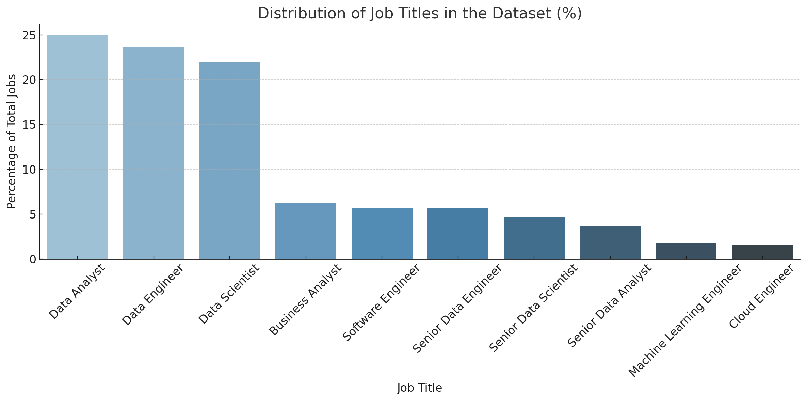
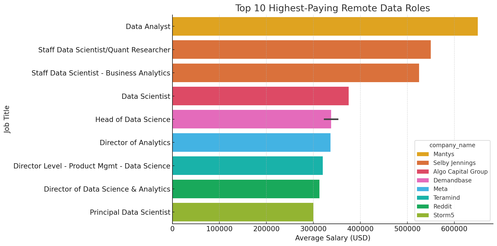
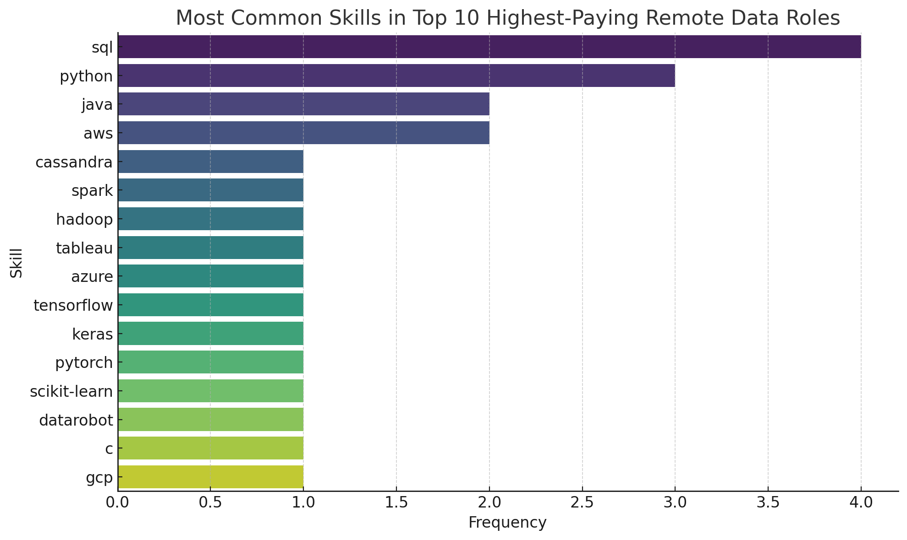
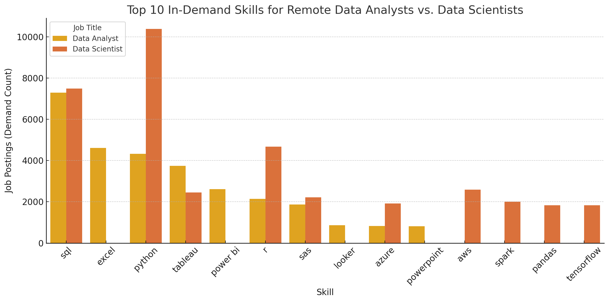
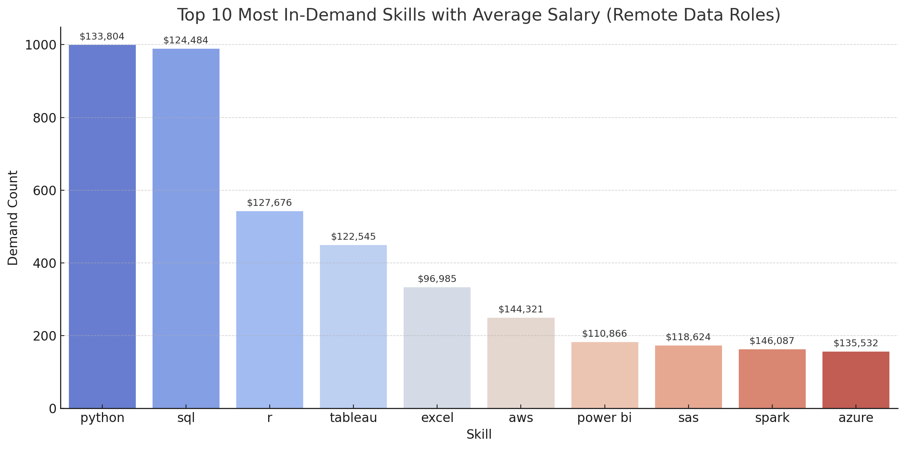

# Introduction

Welcome to my first SQL project! Inspired by Luke Barousse’s course, I dove into real job posting data to better understand the landscape for aspiring data professionals. This project focuses on two key roles — Data Analyst and Data Scientist — and uses SQL to uncover:

💼 The most in-demand skills

💰 Where the top-paying remote jobs are

📊 How demand compares between these roles

All analysis was done using SQL, and you can explore my queries in the [project_sql](project_sql/).

# Background

Driven by a desire to better understand and navigate the data analyst job market, this project aims to uncover which roles offer the highest pay, what skills are most in demand, and where the best opportunities lie for remote work. The goal was to streamline the job search process — not just for myself, but for others entering the field.

The dataset used in this project comes from a [SQL course](https://www.lukebarousse.com/sql) I completed and contains rich information on job titles, salaries, locations, work settings, and required skills — providing a solid foundation for insightful analysis.

Through a series of SQL queries, I set out to answer key questions like:

💼 Which data roles are most common in the job market?

💰 What are the top-paying positions?

🌍 How many roles offer remote work opportunities?

🛠️ What skills are most in demand for Data Analysts vs. Data Scientists?

⚖️ Where do high demand and high salary intersect?

# Tools I Used

As part of my in-depth exploration of the data analyst/data scientist job market, I relied on a core set of tools to drive my analysis:

- SQL: served as the foundation, enabling me to extract and interpret meaningful trends from the database.
- PostgreSQL: was the database system I used, well-suited for managing the job postings dataset efficiently.
- VsCode: acted as my primary environment for writing and running SQL queries.
- GitHub: were vital for tracking changes, managing versions, and sharing my code and findings throughout the project.

# The Analysis

### 1. Which Job Role dominates the Job market

I started by analyzing the distribution of job titles to see which roles are most common. I calculated both the total count and percentage share of each role to better understand the job market landscape.

```sql
WITH job_counts AS (
    -- CTE for outputing the absolut number of each job title.
    SELECT
        job_title_short,
        COUNT(job_id) AS count_jobs
    FROM 
        job_postings_fact
    GROUP BY 
        job_title_short
),
total AS (
    -- CTE for calculating the total amount of jobs.
    SELECT 
        SUM(count_jobs) AS total_jobs 
    FROM job_counts
)
SELECT 
    job_counts.job_title_short,
    job_counts.count_jobs,
    ROUND(100.0 * job_counts.count_jobs / total.total_jobs, 2) AS percentage
FROM job_counts, total
ORDER BY job_counts.count_jobs DESC;
```

Here’s a quick breakdown of your query results:

📊 Job Title Distribution Insights:
Data Analyst, Data Engineer, and Data Scientist dominate the dataset — making up over 70% of all job postings combined.

Business Analysts and Software Engineers follow, each with around 5–6% of the share.

Senior-level roles like Senior Data Engineer, Senior Data Scientist, and Senior Data Analyst make up a smaller, but still significant portion.

Machine Learning Engineers and Cloud Engineers have the smallest shares in this top 10 list — under 2% each.


*Percentage distribution of the top 10 job titles in the dataset, highlighting the dominance of core data roles like Data Analyst, Data Engineer, and Data Scientist*

### 2. Highest-Paying Remote Jobs: Data Analyst vs. Data Scientist

To understand where the highest remote salaries lie, I expanded the scope to include both Data Analyst and Data Scientist roles. This query retrieves the top 10 highest-paying fully remote jobs, showing not only salaries but also job titles, posting dates, and company names.

```sql
/*
    Retrieves the top 10 highest-paying remote jobs for Data Analysts and Data Scientists
*/

SELECT
    job_id,
    job_title,
    job_location,
    job_schedule_type,
    salary_year_avg,
    job_posted_date,
    name AS company_name
FROM
    job_postings_fact
LEFT JOIN company_dim ON job_postings_fact.company_id = company_dim.company_id
WHERE
    salary_year_avg IS NOT NULL AND
    job_title_short IN ('Data Analyst', 'Data Scientist') AND
    job_location = 'Anywhere'
ORDER BY
    salary_year_avg DESC
LIMIT 10
```

📊 Insights: Top Remote Salaries in Data Roles
The highest listed salary is a Data Analyst role at Mantys, offering $650,000/year.

Most high-paying roles are senior-level Data Scientist positions, including titles like Staff Data Scientist, Head of Data Science, and Director of Analytics.

Companies like Selby Jennings, Demandbase, and Meta repeatedly appear, signaling they offer competitive compensation in the remote space.

These results reflect how seniority and specialization (e.g. quant research, business analytics) play a major role in salary levels.


*Top 10 highest-paying remote Data roles by salary — highlighting the prominence of senior-level and leadership positions.*

### 3. Which Skills Show Up in the Highest-Paying Remote Roles?

After identifying the top-paying remote roles for Data Analysts and Data Scientists, I wanted to dig deeper into the skills required for those high-salary positions. This query pulls in the specific technical skills associated with each of the top 10 highest-paying remote jobs.

By joining the skills tables, we can see what tools and technologies top-paying employers expect.

```sql
/*
    Retrieves the skills required for the top 10 highest-paying remote Data Analyst 
    and Data Scientist roles
*/

WITH top_paying_jobs AS (
    SELECT 
        job_id,
        job_title,
        salary_year_avg,
        name AS company_name
    FROM
        job_postings_fact
    LEFT JOIN company_dim ON job_postings_fact.company_id = company_dim.company_id
    WHERE
        job_title_short IN ('Data Analyst', 'Data Scientist') AND 
        job_location = 'Anywhere' AND 
        salary_year_avg IS NOT NULL
    ORDER BY
        salary_year_avg DESC
    LIMIT 10
)
SELECT
    top_paying_jobs.*,
    skills
FROM top_paying_jobs
INNER JOIN skills_job_dim ON top_paying_jobs.job_id = skills_job_dim.job_id
INNER JOIN skills_dim ON skills_dim.skill_id = skills_job_dim.skill_id
ORDER BY
    salary_year_avg DESC;
```

📊 Insights: Skills Behind the Big Salaries
This query reveals what skills are tied to the top-paying roles — providing a clear signal of what tools or technologies employers value most when offering top-tier compensation.

Results include roles like Staff Data Scientist, Director of Analytics, and Head of Data Science — all connected to in-demand skills like Python, SQL, AWS, and machine learning frameworks.

The dataset shows multiple skills per job, so expect some overlap — but also variations depending on seniority and specialization.

🔎 Why This Matters:
If you're targeting high-salary, remote roles, this analysis shows exactly which skills to master to stay competitive in the market.


*Frequency of technical skills required in the top 10 highest-paying remote Data Analyst and Data Scientist job postings — highlighting the dominance of core skills like SQL, Python, and cloud technologies.*

🔍 Key Takeaways:
SQL and Python are the most frequently required skills, showing up in multiple high-paying roles.

Tools like AWS, Java, and advanced ML libraries like TensorFlow, Keras, and PyTorch also appear prominently.

These skills reflect a mix of data engineering, analytics, and machine learning expertise — a strong stack for high-salary roles.

### 4. Most In-Demand Skills for Remote Data Roles

To better understand what tools and technologies are most valued in remote positions, I analyzed the top 10 most frequently requested skills for both Data Analysts and Data Scientists.

This query uses a ROW_NUMBER() window function to rank the top 10 skills independently for each role, giving a side-by-side look at what’s most in demand.

```sql
/*
    Returns the most in-demand skills overall for remote Data Analyst and Data Scientist jobs
*/


SELECT *
FROM (
    SELECT 
        job_title_short,
        skills,
        COUNT(skills_job_dim.job_id) AS demand_count,
        ROW_NUMBER() OVER (PARTITION BY job_title_short ORDER BY COUNT(skills_job_dim.job_id) DESC) AS rank
    FROM job_postings_fact
    INNER JOIN skills_job_dim ON job_postings_fact.job_id = skills_job_dim.job_id
    INNER JOIN skills_dim ON skills_job_dim.skill_id = skills_dim.skill_id
    WHERE
        job_title_short IN ('Data Analyst', 'Data Scientist')
        AND job_work_from_home = TRUE 
    GROUP BY
        job_title_short,
        skills
) ranked
WHERE rank <= 10;
```

📊 Insights: Role-Specific Skill Demand
Data Analysts most commonly require SQL, Excel, Python, and Tableau, reflecting their focus on reporting, dashboards, and business analysis.

Data Scientists tend to demand Python, SQL, R, AWS, and tools like TensorFlow and Spark, highlighting a more advanced and programming-heavy skill set.

This ranking clearly shows how technical requirements shift between roles, even within remote job postings.


*Comparison of the top 10 most frequently requested skills in remote job postings for Data Analysts and Data Scientists. SQL and Python dominate both roles, while analysts lean toward tools like Excel and Tableau, and scientists lean into AWS, Spark, and machine learning frameworks.*

### 5.Which Skills Are Linked to Higher Remote Salaries

Understanding which skills are not only in demand but also associated with higher salaries can help prioritize what to learn or highlight on a resume. This query calculates the average salary for each skill found in remote job postings for Data Analysts and Data Scientists.

The results are sorted to show the top 25 highest-paying skills based on the average salary across relevant job postings.

```sql
SELECT
    skills,
    ROUND(AVG(salary_year_avg), 0) AS avg_salary
FROM job_postings_fact
INNER JOIN skills_job_dim ON job_postings_fact.job_id = skills_job_dim.job_id
INNER JOIN skills_dim ON skills_job_dim.skill_id = skills_dim.skill_id
WHERE
    job_title_short IN ('Data Analyst', 'Data Scientist')
    AND salary_year_avg IS NOT NULL
    AND job_work_from_home = True 
GROUP BY
    skills
ORDER BY
    avg_salary DESC
LIMIT 25;
```

📊 Insights: Skills That Pay Off
The results highlight which technical skills are most strongly associated with higher-paying remote roles.

Some of these skills may not be the most common, but they are often tied to senior or specialized roles — boosting their salary averages.

This insight is useful for shaping a learning path, portfolio focus, or upskilling strategy.

| Rank | Skill      | Avg Salary (USD) |
|------|------------|------------------|
| 1    | gdpr       | $217,738         |
| 2    | bitbucket  | $189,155         |
| 3    | golang     | $187,500         |
| 4    | selenium   | $180,000         |
| 5    | opencv     | $172,500         |
| 6    | neo4j      | $171,655         |
| 7    | dynamodb   | $169,670         |
| 8    | tidyverse  | $165,513         |
| 9    | solidity   | $165,000         |
| 10   | datarobot  | $162,998         |

### 6. Which Skills Blance High Demand and High Salary?

To identify the most valuable skills overall, I combined two key metrics:

Demand: How often each skill appears in job postings

Average Salary: The average salary for jobs that require that skill

This gives a more well-rounded view of which skills are both popular and well-paid in remote Data Analyst and Data Scientist roles.

```sql
/*
    Combines skill frequency (demand) with average salary across remote data jobs
*/


WITH skills_demand AS (
    SELECT 
        skills_dim.skill_id,
        skills_dim.skills,
        COUNT(skills_job_dim.job_id) AS demand_count
    FROM job_postings_fact
    INNER JOIN skills_job_dim ON job_postings_fact.job_id = skills_job_dim.job_id
    INNER JOIN skills_dim ON skills_job_dim.skill_id = skills_dim.skill_id
    WHERE
        job_title_short IN ('Data Analyst', 'Data Scientist')
        AND job_work_from_home = True 
        AND salary_year_avg IS NOT NULL
    GROUP BY
        skills_dim.skill_id
)

, average_salary AS(
    SELECT
        skills_job_dim.skill_id,
        ROUND(AVG(salary_year_avg), 0) AS avg_salary
    FROM job_postings_fact
    INNER JOIN skills_job_dim ON job_postings_fact.job_id = skills_job_dim.job_id
    INNER JOIN skills_dim ON skills_job_dim.skill_id = skills_dim.skill_id
    WHERE
        job_title_short IN ('Data Analyst', 'Data Scientist')
        AND salary_year_avg IS NOT NULL
        AND job_work_from_home = True 
    GROUP BY
        skills_job_dim.skill_id
)

SELECT
    skills_demand.skill_id,
    skills_demand.skills,
    demand_count,
    avg_salary
FROM
    skills_demand
    INNER JOIN average_salary ON skills_demand.skill_id = average_salary.skill_id
ORDER BY
    demand_count DESC,
    avg_salary DESC
```

📊 Insights: The Best of Both Worlds
This query highlights skills that appear frequently and are tied to higher-than-average salaries.

Tools like SQL, Python, and Tableau often strike a strong balance — appearing in many listings while also pulling solid salaries.

Other high-paying but less frequent skills (e.g., Golang, TensorFlow, Neo4j) may be worth learning to stand out or specialize.


*Top 10 in-demand skills for remote data roles, alongside their average salaries — highlighting a balance between popularity and pay.*

# 🧠 What I learned

This project was a deep dive not just into the job market — but into my own growth as a data explorer. Along the way, I leveled up my SQL game and analytical thinking in a big way:

🔗 Joins with Purpose: Confidently combined multiple tables to extract meaningful insights, linking job postings, companies, and skills like a data detective.

🧠 CTEs & Window Functions: Used WITH clauses and ROW_NUMBER() like a pro to write cleaner, modular queries that answer layered questions.

📊 Aggregations That Matter: Became fluent with GROUP BY, COUNT(), and AVG() to summarize and compare job data at scale.

🔍 Insight-Driven Thinking: Shifted from writing queries to solving real-world questions — from “What’s the most common skill?” to “Which ones pay the most?”

🛠️ Skill vs Salary Analysis: Learned how to balance demand and compensation to identify high-value tools for career growth.

This project turned raw data into career insights — and turned me into a more confident SQL problem-solver.

# Conclusion

### 🔍 Key Insights from the Analysis

- Top-Paying Remote Roles: The highest-paying remote jobs for Data Analysts and Data Scientists reach impressive salaries — up to $650,000, often tied to senior or specialized positions.

- Skills Behind the Big Salaries: High-paying jobs consistently require core skills like SQL and Python, while niche tools like Golang, Datarobot, and Solidity show up in elite salary brackets.

- In-Demand Technologies: SQL leads the way in demand across both Data Analyst and Data Scientist roles, making it a non-negotiable skill for job seekers in the field.

- Skill-Salary Balance: Some skills, like AWS, Spark, and TensorFlow, strike a great balance between frequency and high average salary — ideal targets for upskilling.

- Market Value Maximizers: Skills that combine high demand and strong salary potential, such as SQL, Python, and Azure, are optimal for anyone looking to increase their market competitiveness.

### 💬 Final Thoughts

This project was more than just a technical challenge — it was a window into the evolving landscape of the data job market. It sharpened my ability to write efficient, insight-driven SQL queries while delivering real-world knowledge on how to align skills with career opportunities.

Whether you're an aspiring Data Analyst, a transitioning professional, or just SQL-curious — this exploration proves the power of combining data skills with curiosity. The path to a rewarding data career becomes clearer when we know what to learn, what pays, and what companies are truly looking for.
